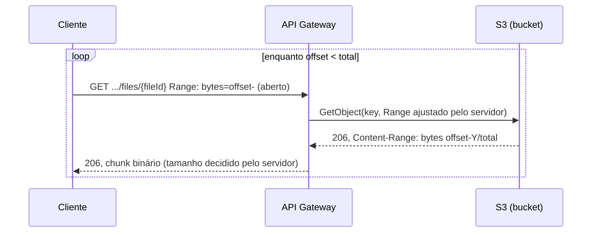

# apigw-transfer — Arquitetura

Documento de Arquitetura Técnica · v1.0 · 2026

> Este documento descreve o estado **atual** da implementação, de forma
> resumida e voltada a quem precisa entender o funcionamento sem ler o
> histórico completo de decisões. Para o detalhamento de cada achado
> (bugs de VTL, validações contra AWS real, números de payload) ver
> [SPEC.md](../SPEC.md); para o roadmap por fases, [PLAN.md](../PLAN.md);
> para o contrato normativo do cliente, [docs/client-behavior.md](client-behavior.md);
> para a decisão e as alternativas descartadas, [ADR 0001](adr/0001-proxy-download-via-api-gateway-s3.md).

## 1. Visão geral

Proxy de download de arquivos privados do S3, exposto via Amazon API
Gateway, **sem aplicação ou função Lambda no caminho de transferência de
um arquivo já existente no bucket**. O objetivo é provar que arquivos
grandes (validado com um objeto real de ~109 MB) podem ser servidos
através do único padrão de exposição de arquivos privados aceito pelo
conglomerado — API Gateway com mTLS e token do banco — sem os custos de
compute que uma integração via Lambda implicaria.

| Objetivo principal: servir arquivos privados do S3 em blocos de tamanho seguro, com o servidor (não o cliente) garantindo que nenhuma resposta ultrapasse o teto de payload do API Gateway, e sem compute no caminho de um objeto já populado. |
| :---- |

## 2. Componentes

| Componente | Serviço AWS | Responsabilidade |
| :---- | :---- | :---- |
| Ponto de entrada | API Gateway (REST API, edge-optimized) | Recebe a requisição HTTP e repassa direto pro S3 via integração de serviço AWS |
| Integração de download | AWS Service Proxy (`GET`/`HEAD /files-delivery/{fileDeliveryId}/files/{fileId}`) | Traduz a requisição em `GetObject`/`HeadObject` no S3; uma transformação de requisição (VTL) ajusta/injeta o header `Range` pra nunca ultrapassar o teto de payload |
| Armazenamento | Amazon S3 (privado) | Bucket já existente, reaproveitado de um projeto anterior — nunca criado por este projeto |
| Configuração em runtime | Stage variables do API Gateway | Bucket alvo, teto de tamanho de chunk e tempo de cache de erro — ajustáveis sem novo deployment da API |
| Cache-miss (fallback) | PoC: AWS Lambda (`cmd/fallback`) com autoinvocação assíncrona. Final: o BFF | Só entra em ação quando o objeto ainda não existe no path direto: responde `202` a todos e copia da origem pro path direto em background (ADR 0001) |
| Origem simulada | Amazon S3 (mesmo bucket, prefixo `origin/`) | Substitui uma origem externa real pra fins de PoC |
| Concorrência | Lock não-bloqueante no S3 | Evita múltiplas execuções do fallback buscarem o mesmo objeto ao mesmo tempo; quem perde a corrida recebe `202` + `Retry-After` |
| Permissão de acesso ao S3 | IAM Role de execução do API Gateway | Escopada só aos objetos de teste, não ao bucket inteiro |
| Autenticação de transporte *(pendente)* | mTLS (custom domain + truststore) | Padrão de destino aprovado — ver ADR 0001 |
| Autorização *(pendente)* | Token do banco | Padrão de destino aprovado — ver ADR 0001 |

## 3. Fluxo de download (caminho feliz)

O cliente não escolhe tamanho de bloco nem precisa saber o tamanho total
de antemão — o servidor sempre limita a resposta a um teto seguro
(configurável via stage variable), e o próprio `Content-Range` da
primeira resposta já revela o total. Detalhes completos, incluindo a
variante com `HEAD` opcional e os fluxos de cache-miss/concorrência, em
[docs/client-behavior.md](client-behavior.md).

## 4. Cache-miss e concorrência

Quando o objeto não existe no path direto, o `404` do S3 é convertido em
`302` (montado dinamicamente via VTL, sem compute nesse passo) apontando
para `/files-delivery/{fileDeliveryId}/retrievals/{retrievalId}`. Esse endpoint, sim, aciona o serviço de fallback
(Lambda nesta implementação — ver §2), que:

1. Confere se o objeto já existe (cópia já terminou) e, se sim, redireciona
   de volta.
2. Tenta um lock não-bloqueante no S3; se já travado, responde `202` +
   `Retry-After` na hora.
3. Com o lock, confere se o objeto existe na origem (`404` cacheável se
   não), dispara a cópia numa invocação assíncrona — que fica dona do
   lock e o libera ao terminar — e responde `202` + `Retry-After`.

A requisição nunca espera a cópia: o tempo de cópia não depende do
timeout de integração do API Gateway, só do timeout da função (TTL do lock
≥ timeout, garantido por precondição no Terraform).

Consistência entre blocos de um mesmo download usa `If-Match`/`ETag`
nativos do S3 — se o objeto mudar de versão no meio do processo, a
resposta vira `412` em vez de misturar bytes de duas versões.

## 5. Cache negativo (proteção contra retentativas)

Duas respostas do serviço de fallback carregam `Cache-Control: max-age`:

- **`202`** (lock ocupado): usa o mesmo valor do `Retry-After` (na PoC,
  variável de ambiente `RETRY_AFTER_SECONDS` da Lambda) — protege
  contra vários clientes reconsultando a mesma key popular enquanto ela
  está sendo populada (mitiga estouro de manada sem infraestrutura de
  cache adicional).
- **`404`** definitivo (objeto não existe nem na origem simulada): erro
  irrecuperável sem intervenção humana — cacheável com segurança. O valor
  vem da stage variable `notFoundMaxAgeSeconds` (ajustável sem redeploy).

Erros transitórios (falha de lock por permissão, falha de upload) **não**
carregam esse header de propósito — cachear uma falha transitória
estenderia a indisponibilidade além do problema real. Hoje essa proteção
é client-side apenas (depende do cliente ter cache HTTP configurado); um
cache compartilhado do lado do servidor (stage cache nativo do API
Gateway) foi avaliado e adiado — tem custo real (~$15/mês) e a decisão
foi deixada pra quando houver dado de uso real (ver ADR 0001).

## 6. Segurança (estado atual)

- **S3 completamente privado** — sem bucket policy pública, acesso só via
  a IAM role escopada do API Gateway.
- **IAM role de execução** limitada aos objetos de teste, não ao bucket
  inteiro.
- **Sem mTLS e sem validação de token nesta rodada** — decisão explícita,
  documentada no ADR 0001. O endpoint atual não tem autenticação na
  borda; isso é o principal item pendente antes de qualquer uso além de
  PoC.

## 7. Limitações conhecidas

- Teto de payload do API Gateway (10 MB) é rígido — sem essa arquitetura,
  ultrapassá-lo falharia abruptamente; é justamente o que o clamp
  reativo do servidor existe para evitar.
- Multi-range numa única requisição não é suportado (limitação do S3).
- Sem cache de CDN adicional — o S3 já é a fonte da verdade. O stage
  cache nativo do API Gateway foi avaliado e adiado (custo, ver ADR 0001).
- Objetos endereçáveis até ~950 MB: a validação do `Range` aceita até 9
  dígitos no início do intervalo.
- mTLS e a validação do token do banco permanecem em aberto — ver ADR 0001.
