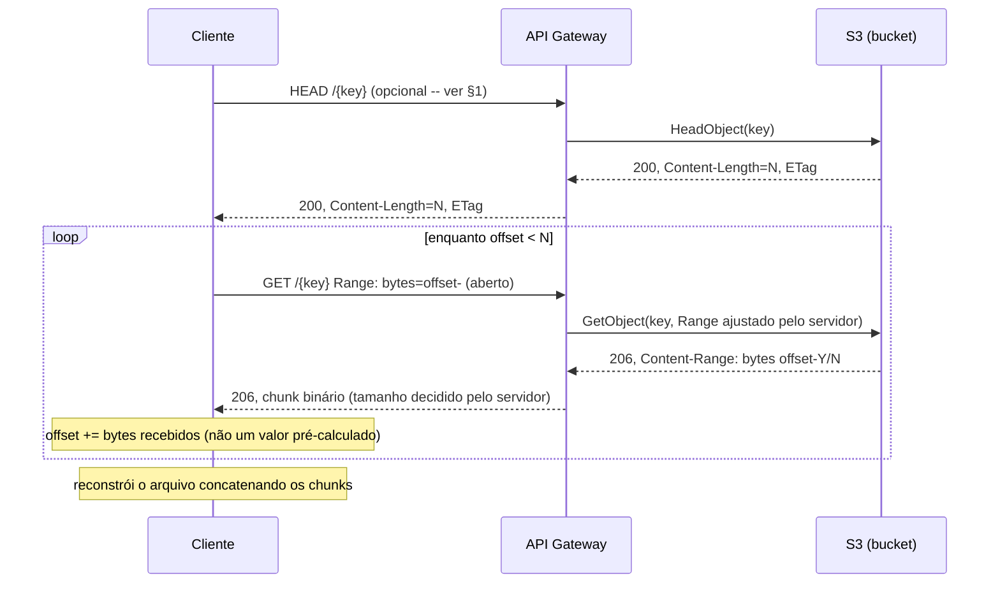
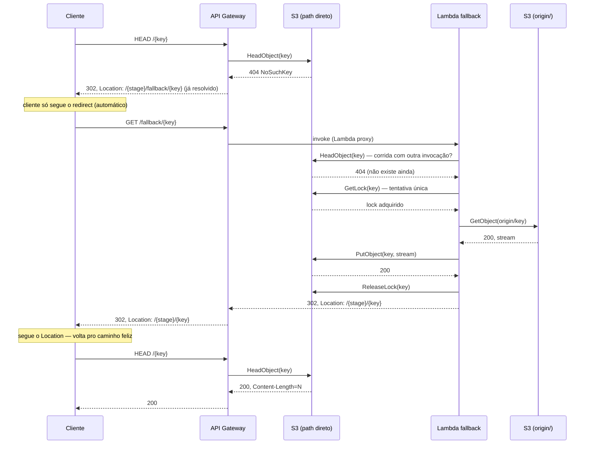
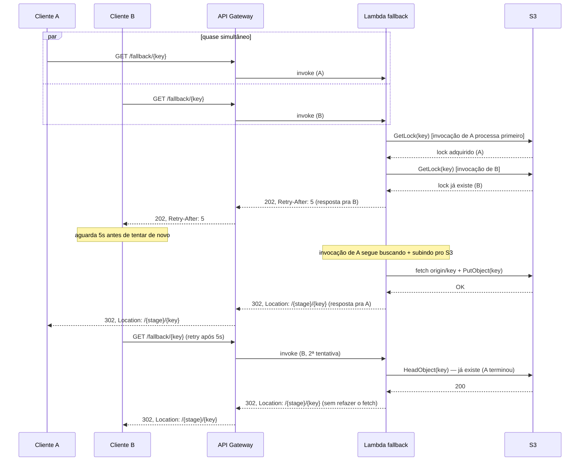
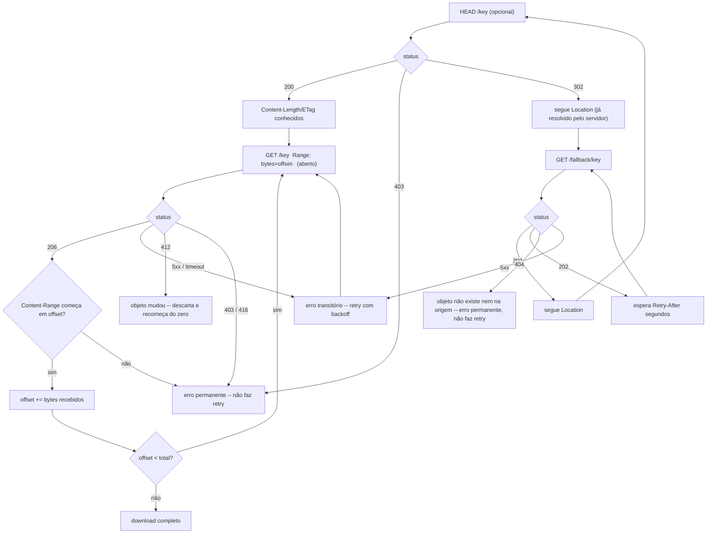

# Comportamento esperado do cliente

Este documento descreve o contrato que qualquer cliente (biblioteca, SDK,
script) precisa seguir pra consumir o proxy `apigw-transfer` corretamente.
Complementa o [SPEC.md](../SPEC.md) (arquitetura) e o [PLAN.md](../PLAN.md)
(fases) — aqui o foco é só "o que o cliente deve fazer", não como o
servidor é montado.

## 1. Visão geral do contrato

- **Descoberta de tamanho:** `HEAD /{key}` é **recomendado, mas não
  mais obrigatório** (mudou depois do merge do clamp reativo em
  produção — ver SPEC.md §9). O servidor sempre limita/injeta o `Range`
  antes de repassar ao S3, então até o **primeiro `GET`** (com ou sem
  `Range`) já vem como `206` com `Content-Range: bytes X-Y/total` — o
  tamanho total sai daí de graça. Um cliente pode pular o `HEAD` e só
  fazer `GET`s em loop, olhando `Content-Range` a cada resposta. `HEAD`
  continua útil se você quer confirmar existência/`ETag` antes de
  começar a escrever no disco, mas não é mais uma etapa obrigatória.
- **Download:** `GET /{key}` em blocos — o cliente pede
  `Range: bytes={offset}-` (aberto, sem fim) e o **servidor** decide
  quanto devolve por resposta (nunca mais que o teto configurado — ver
  SPEC.md §5/§9). O cliente não escolhe/calcula tamanho de bloco; avança
  pelo tamanho **real** recebido em cada resposta (`Content-Range` ou
  `len(corpo)`), não por um valor pré-calculado. Formatos aceitos:
  `bytes=N-` e `bytes=N-M`. Qualquer outro (sufixo `bytes=-N`,
  multi-range, `bytes=N-M/total`, fim menor que início) é **ignorado** e
  tratado como `bytes=0-` — o cliente deve conferir que o início do
  `Content-Range` é o offset pedido antes de gravar o bloco.
- **Cache-miss:** se `/{key}` responder `404`, o servidor responde `302`
  com um `Location` **já totalmente resolvido** (ex.:
  `/dev/fallback/apigw-transfer-fallback-test.bin`, montado dinamicamente
  no servidor via VTL — ver módulo `apigw_s3_proxy`). O cliente pode
  **seguir esse redirect automaticamente**, igual qualquer `302` HTTP
  normal (`curl -L`, browsers, a maioria das libs fazem isso sozinhas) —
  não precisa montar nem resolver nada manualmente.
- **Concorrência:** se `/fallback/{key}` responder `202`, o cliente
  **precisa** respeitar o header `Retry-After` antes de tentar de novo —
  não é opcional, é o mecanismo que evita buscas duplicadas na origem. Na
  PoC o fallback é uma Lambda síncrona (quem pega o lock recebe `302` ao
  fim da cópia); no desenho final o fallback é assíncrono e responde `202`
  **a todos, inclusive na primeira requisição** (ver ADR 0001). O cliente
  deve tratar `202` a qualquer momento da cadeia.

## 2. Caminho feliz — arquivo já existe

`HEAD` é opcional (ver §1) — o diagrama mostra a variante que ainda o
usa (é o que `scripts/download_range.py` faz, pra pegar o `ETag` cedo),
mas um cliente pode começar direto pelo `GET` de dentro do loop.

## 3. Cache-miss — arquivo existe na origem simulada

## 4. Concorrência — dois clientes pedem a mesma key ao mesmo tempo

## 5. Fluxo de decisão do cliente

## 6. Regras de comportamento (normativas)

| Situação | O cliente DEVE |
|---|---|
| Antes de baixar | `HEAD /{key}` é **recomendado**, não mais obrigatório — o servidor sempre clampa a resposta, então até o `GET` sem `Range` revela o tamanho total via `Content-Range` (ver §1). Fazer `HEAD` primeiro continua sendo útil pra confirmar existência/`ETag` antes de abrir o arquivo de saída. |
| Download | Pedir `Range: bytes={offset}-` (aberto, sem fim) — o servidor decide quanto devolve, sempre dentro do teto configurado (SPEC.md §5/§9). Não precisa (e não deve) calcular um fim de range. Antes de gravar, conferir que o início do `Content-Range` é o offset pedido — um `Range` fora dos formatos aceitos é ignorado e a resposta começa no byte 0. |
| Tamanho de chunk | **Não é mais escolha do cliente.** O servidor sempre limita a resposta a um teto seguro, independente do que o cliente pede ou não pede. O cliente só precisa avançar pelo tamanho **real** recebido (`len(corpo)`/`Content-Range`) a cada resposta, nunca por um valor fixo pré-calculado. |
| `404`/`302` no path direto | Seguir o `Location` — já vem resolvido (path real, sem template) e pode ser seguido automaticamente como qualquer redirect HTTP. |
| `202` no `/fallback/{key}` | **Obrigatório** respeitar o `Retry-After` (segundos) antes de tentar de novo. Não fazer polling mais frequente que isso — é o mecanismo que evita buscas duplicadas na origem. Pode aparecer inclusive na primeira requisição (fallback assíncrono do desenho final). |
| `302` no `/fallback/{key}` | Seguir o `Location` (path relativo, já inclui o stage) — geralmente volta pro path direto, que agora deve responder `200`/`206`. |
| `404` no `/fallback/{key}` | Erro **permanente** — o objeto não existe nem na origem simulada. Não adianta repetir. |
| `403` no path direto | Erro **permanente** — acesso negado à key. Não adianta repetir. |
| `416` no path direto | Erro **permanente** pro offset pedido — o `Range` começa além do fim do objeto (ex.: arquivo local maior que o remoto). Não repetir o mesmo offset; revalidar tamanho/`ETag` com `HEAD`. |
| `500`/`502` (qualquer endpoint) | Erro transitório — retry com backoff exponencial (ex.: 1s, 2s, 4s..., com teto e número máximo de tentativas). `502` é o catch-all do path direto pra qualquer status do S3 sem mapeamento próprio. |
| Timeout de rede | Tratar como erro transitório — retry com backoff, igual a um 500. |
| Consistência entre chunks | Guardar o `ETag` do `HEAD` inicial e mandar `If-Match: <etag>` em todo `GET` com `Range` — se o arquivo mudar no meio do download, o S3 responde `412 Precondition Failed` (o servidor repassa isso, não mascara como 200). |
| `412` num chunk | Erro **permanente pro download em andamento** — o objeto mudou de versão no meio do processo. Não adianta retentar o mesmo chunk; é preciso descartar o que já foi baixado e recomeçar do zero com a versão atual (novo `HEAD`, novo `ETag`). |
| Retomar download interrompido | Guardar o `ETag` junto com o arquivo parcial (ex.: sidecar `<arquivo>.etag`). Ao retomar: fazer `HEAD` de novo — se o `ETag` bater com o salvo, continuar do byte onde parou (`Range` começando do tamanho atual do arquivo local); se não bater, descartar o parcial e recomeçar do zero. |

## 7. Recomendações de implementação (não normativo, mas validado na prática)

A referência completa dessas recomendações é [scripts/download_range.py](../scripts/download_range.py)
— cliente funcional só com stdlib que implementa o contrato inteiro deste
documento e foi validado ponta a ponta contra AWS real (caminho feliz,
cache-miss, concorrência, `412`, retomada).

- **Use uma biblioteca HTTP que siga redirects automaticamente.** Não
  implemente resolução manual de `Location` — desde que o servidor monte
  o `Location` já resolvido (ver §1, §3), qualquer cliente HTTP padrão
  que segue `302` sozinho (`curl -L`, browsers, `urllib`/`requests` em
  Python, `net/http` em Go com `CheckRedirect` padrão, etc.) atravessa a
  cadeia inteira `/{key} → /fallback/{key} → /{key}` sem lógica extra.
- **Confirme que a lib preserva os headers da requisição original ao
  seguir o redirect.** A cadeia de cache-miss passa pelo mesmo host, mas
  o cliente precisa continuar mandando `Range`/`If-Match` na requisição
  final — a maioria das libs preserva headers customizados em redirects
  `GET`/`HEAD` para o mesmo host, mas isso não é universal entre
  linguagens/bibliotecas; valide esse comportamento explicitamente antes
  de confiar nele.
- **Trate `202` como um caso à parte do redirect, não como um redirect.**
  Não é `Location` pra seguir — é "espere `Retry-After` e repita a
  *mesma* requisição". Isolar isso num wrapper genérico (como
  `request()` em `download_range.py`) evita duplicar a lógica em cada
  call site e mantém o retry de cache-miss desacoplado do retry de chunk
  (que é sobre erro transitório tipo `500`, uma preocupação diferente).
- **Trate `412` como erro terminal no ponto onde é detectado**, não como
  um valor de retorno comum que quem chama precisa lembrar de checar —
  levantar a exceção ali mesmo (em vez de devolver o status e confiar
  numa checagem externa) evita que um refactor futuro esqueça o caso e
  acabe concatenando bytes de duas versões diferentes do objeto.
- **Imponha um teto de tempo/tentativas total para o cache-miss**, não só
  por chunk — sem isso, um `202` que nunca resolve (lock preso, Lambda
  com erro recorrente) faz o cliente fazer polling pra sempre.

## 8. Referência OkHttp (Android)

Sketch completo em
[docs/examples/OkHttpFallbackInterceptor.kt](examples/OkHttpFallbackInterceptor.kt).
A ideia é configurar isso uma vez no `OkHttpClient` e qualquer chamada
feita com ele já segue o contrato deste documento sem o chamador precisar
checar `202`/`412` manualmente a cada requisição:

| Parte do contrato | Quem resolve |
|---|---|
| `302` (cache-miss) | O próprio OkHttp — segue redirect por padrão, e o `Location` já vem resolvido com a key real pelo servidor (§3), sem lógica extra |
| `202` + `Retry-After` | `FallbackRetryInterceptor` — espera e repete a *mesma* requisição, até um teto de tempo (mesmo papel do wrapper `request()` em `scripts/download_range.py`) |
| `412` | `PreconditionFailedInterceptor` — lança exceção no ponto de detecção, em vez de devolver como resposta "normal" que o chamador precisa lembrar de checar |
| Loop de chunking, offset de resume, leitura/escrita do `ETag` em disco | Fica no app — não cabe num interceptor (que só enxerga uma request/response por vez); ver `download()`/`head()` em `scripts/download_range.py` como referência da mesma lógica em Python |

## 9. Limites conhecidos (não normativo, mas relevante pro cliente)

- O teto de payload do API Gateway é **rígido**: ultrapassar causa falha
  abrupta (não é "entrega parcial e avisa"). Isso não é mais problema do
  cliente ter que evitar manualmente — o servidor sempre limita a
  resposta a um teto seguro, mesmo que o cliente peça mais (ver §1).
- `/fallback/{key}` manda `Cache-Control: max-age` em duas respostas
  específicas: o `202` (mesmo valor do `Retry-After` — protege contra
  vários clientes reconsultando a mesma key popular enquanto ela é
  populada) e o `404` definitivo (key não existe nem na origem —
  configurável via stage variable, default 60s). As demais respostas
  (erro transitório, `302` de sucesso) **não** têm esse header de
  propósito — não devem ser cacheadas. Um cliente HTTP com cache próprio
  configurado (ex.: OkHttp com `Cache` habilitado — não é o default, veja
  §8) aproveita isso automaticamente; sem cache configurado, o header
  simplesmente não faz nada, não é um requisito pro contrato funcionar.
- `binary_media_types` precisa estar configurado no servidor com os
  content-types reais que ele serve (não vazio, e não é obrigatório ser
  `"*/*"`) pra o corpo binário vir intacto — sem isso, o conteúdo vem
  corrompido (não é "só" inflado, ver SPEC.md §5). Isso é responsabilidade
  do servidor, mas o cliente deve validar a integridade do arquivo
  reconstruído (comparar tamanho final com o `Content-Length` do `HEAD`,
  e idealmente usar o mecanismo de `If-Match`/`ETag` acima) — não assumir
  que o corpo veio correto sem checar.
- Não há garantia de quanto tempo o fallback demora pra popular um
  arquivo grande — depende do tamanho do arquivo na origem simulada. O
  cliente deve ter um teto razoável de tentativas/tempo total antes de
  desistir e reportar erro pro usuário final, em vez de fazer polling
  indefinidamente.
