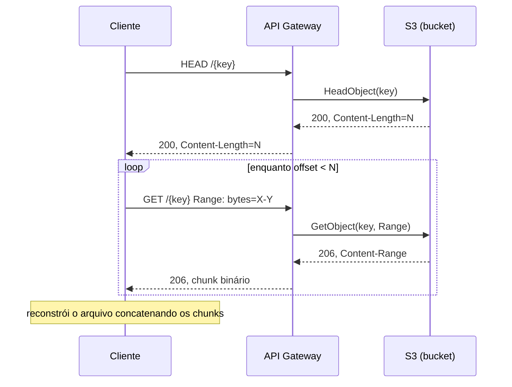
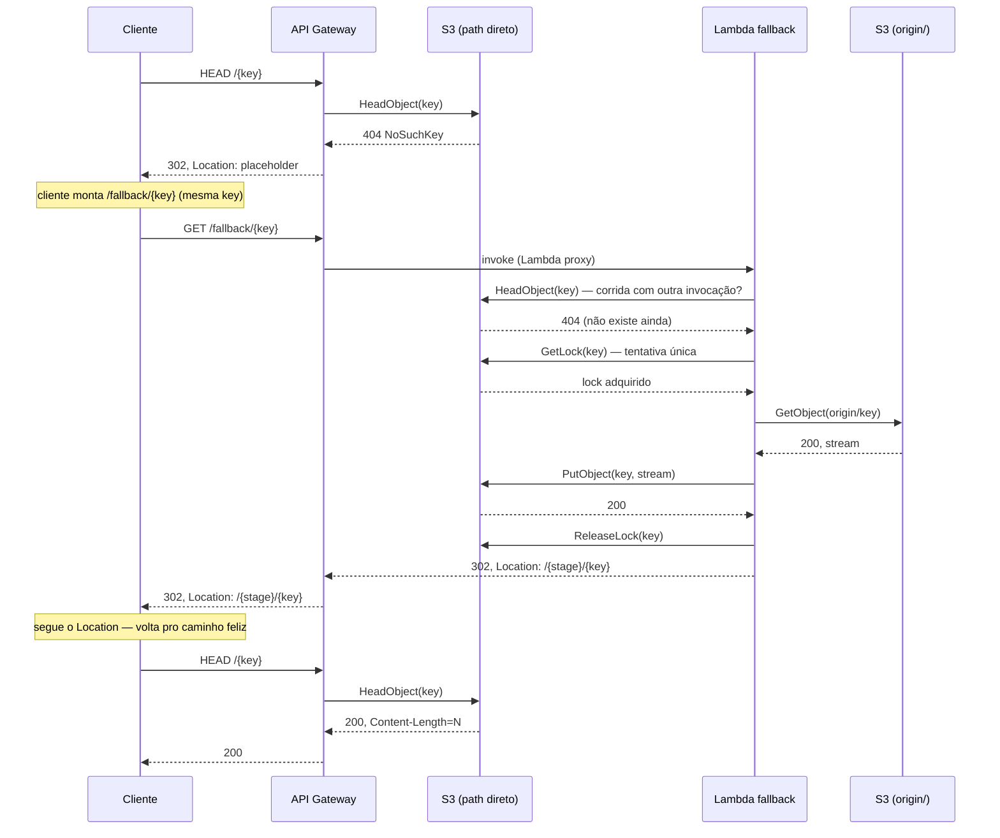
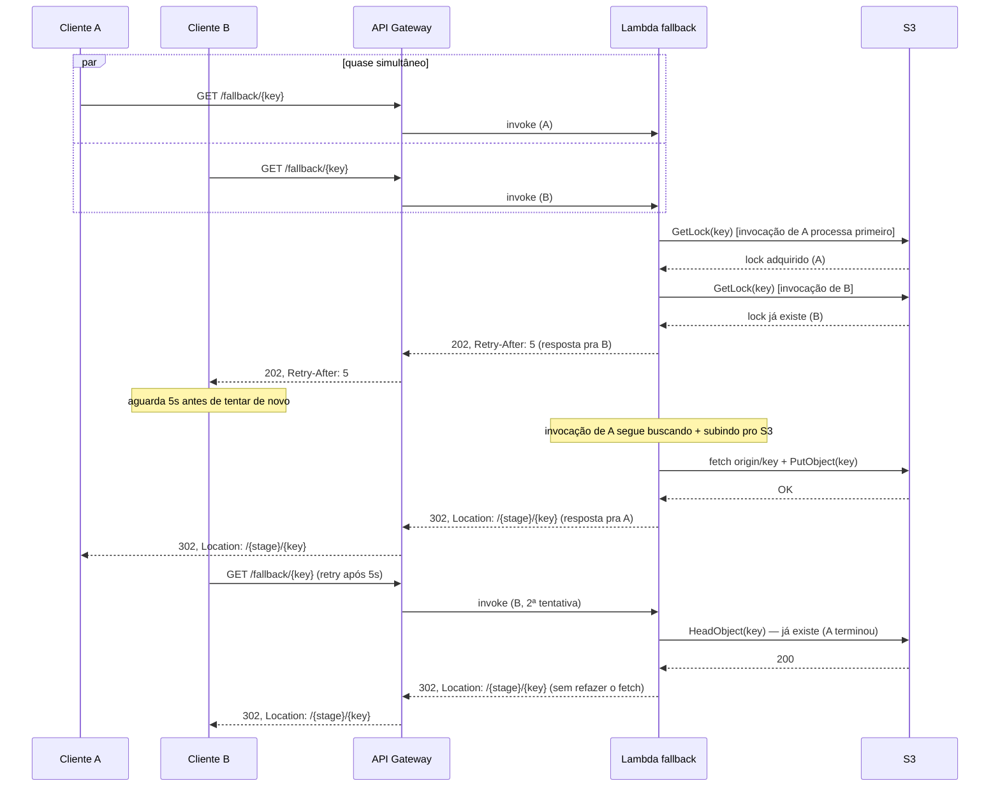
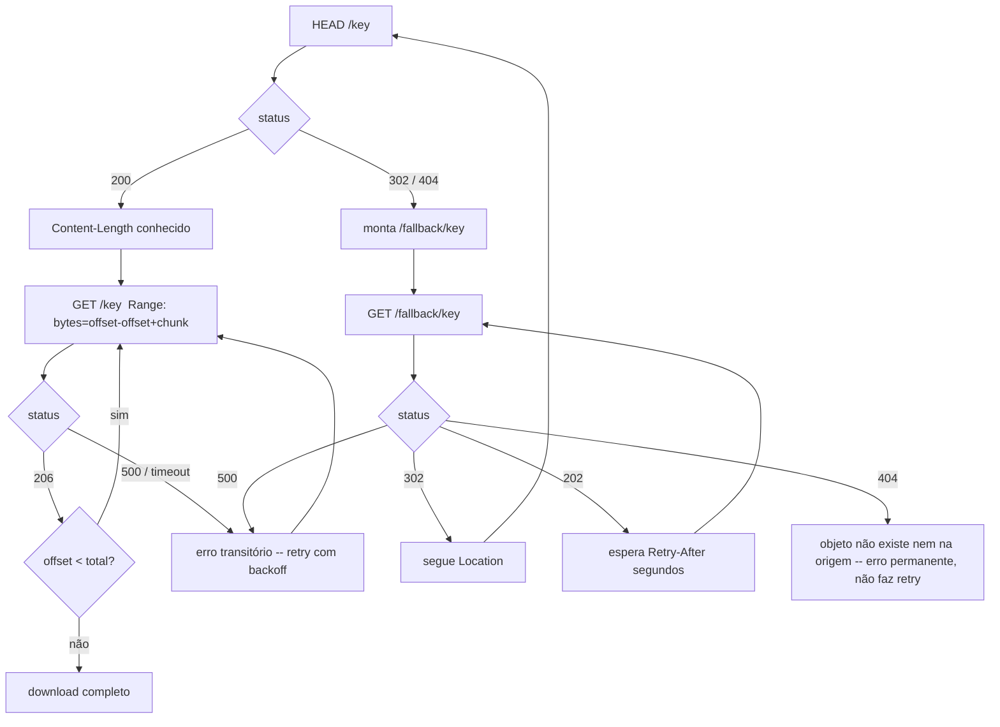

# Comportamento esperado do cliente

Este documento descreve o contrato que qualquer cliente (biblioteca, SDK,
script) precisa seguir pra consumir o proxy `apigw-transfer` corretamente.
Complementa o [SPEC.md](../SPEC.md) (arquitetura) e o [PLAN.md](../PLAN.md)
(fases) — aqui o foco é só "o que o cliente deve fazer", não como o
servidor é montado.

## 1. Visão geral do contrato

- **Descoberta de tamanho:** `HEAD /{key}` sempre primeiro.
- **Download:** `GET /{key}` com header `Range`, em blocos (nunca sem
  `Range` — ver SPEC.md seção 5, teto de payload do API Gateway).
- **Cache-miss:** se `/{key}` responder `302`/`404`, o cliente monta e
  chama `/fallback/{key}` (mesma key) — não é automático/transparente, o
  cliente participa (ver decisão registrada no SPEC.md/memória de
  projeto).
- **Concorrência:** se `/fallback/{key}` responder `202`, o cliente
  **precisa** respeitar o header `Retry-After` antes de tentar de novo —
  não é opcional, é o mecanismo que evita custo duplicado de Lambda.

## 2. Caminho feliz — arquivo já existe

## 3. Cache-miss — arquivo existe na origem simulada

## 4. Concorrência — dois clientes pedem a mesma key ao mesmo tempo

## 5. Fluxo de decisão do cliente

## 6. Regras de comportamento (normativas)

| Situação | O cliente DEVE |
|---|---|
| Antes de baixar | Sempre fazer `HEAD /{key}` primeiro pra saber o tamanho total. |
| Download | Sempre usar `Range` — nunca `GET` sem `Range` num objeto que pode passar do teto de payload do API Gateway (ver SPEC.md §5). |
| Tamanho de chunk | Usar no máximo **8 MiB** por chunk — validado ponta a ponta (Fase 3); tamanhos maiores tiveram comportamento instável nos nossos testes. |
| `404`/`302` no path direto | Montar `/fallback/{key}` com a **mesma key** e tentar lá — não é feito pelo servidor. |
| `202` no `/fallback/{key}` | **Obrigatório** respeitar o `Retry-After` (segundos) antes de tentar de novo. Não fazer polling mais frequente que isso — é o mecanismo que evita concorrência desnecessária de Lambda. |
| `302` no `/fallback/{key}` | Seguir o `Location` (path relativo, já inclui o stage) — geralmente volta pro path direto, que agora deve responder `200`/`206`. |
| `404` no `/fallback/{key}` | Erro **permanente** — o objeto não existe nem na origem simulada. Não adianta repetir. |
| `500` (qualquer endpoint) | Erro transitório — retry com backoff exponencial (ex.: 1s, 2s, 4s..., com teto e número máximo de tentativas). |
| Timeout de rede | Tratar como erro transitório — retry com backoff, igual a um 500. |

## 7. Limites conhecidos (não normativo, mas relevante pro cliente)

- O teto de payload do API Gateway é **rígido**: ultrapassar causa falha
  abrupta (não é "entrega parcial e avisa"). Por isso o chunk de 8 MiB é
  uma recomendação forte, não só uma otimização.
- `binary_media_types = ["*/*"]` precisa estar configurado no servidor
  pra o corpo binário vir intacto — sem isso, o conteúdo vem corrompido
  (não é "só" inflado, ver SPEC.md §5). Isso é responsabilidade do
  servidor, mas o cliente deve validar a integridade do arquivo reconstruído
  (ex.: comparar tamanho final com o `Content-Length` do `HEAD`, ou
  checksum se disponível) — não assumir que o corpo veio correto sem
  checar.
- Não há garantia de quanto tempo o fallback demora pra popular um
  arquivo grande — depende do tamanho do arquivo na origem simulada. O
  cliente deve ter um teto razoável de tentativas/tempo total antes de
  desistir e reportar erro pro usuário final, em vez de fazer polling
  indefinidamente.
